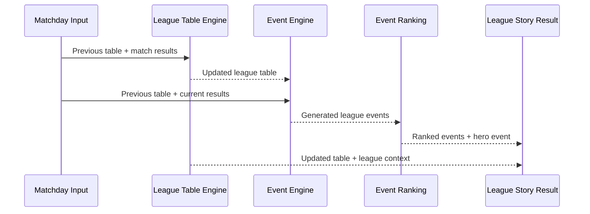

# BMS League Story Engine

## Purpose

The League Story Engine is the deterministic orchestrator for a completed league matchday. It connects the League Table Engine with the rule-based Event Engine and returns the updated table, ranked events, Story of the Week, and structured league context.

The orchestrator is implemented in `app/domain/league-engine/league-story-engine.ts`. It does not replace or duplicate either engine.

## Pipeline

Processing order:

1. calculate the updated league table;
2. translate previous and updated standings plus match results into Event Engine input;
3. generate deterministic league events;
4. rank all generated events by priority;
5. select the highest-priority event as the hero;
6. derive `LeagueContext`.

## Input

`calculateLeagueStory()` receives:

- competition configuration;
- current matchday;
- previous league table;
- official match results for the matchday.

Competition configuration contains:

- competition ID;
- total matchdays;
- points per win;
- Europe ranks;
- relegation ranks.

These values keep league structure outside the generic Event Engine.

## Real Event Engine data

The orchestrator converts the updated table into Event Engine standings containing:

- team and manager IDs;
- team and manager names;
- current rank;
- previous rank;
- current points.

It converts match results into fixtures containing:

- home and away team IDs;
- both ranks before the matchday;
- final fantasy goals.

No dummy standings or hard-coded event outcomes are used by the orchestrator.

## Supported league events

The connected Event Engine evaluates:

- `LEADER_CHANGED`;
- `TITLE_RACE_CLOSE`;
- `LEADER_PULLS_AWAY`;
- `EUROPE_BATTLE_CLOSE`;
- `RELEGATION_BATTLE_CLOSE`;
- `MATCHDAY_SURPRISE`;
- `CHAMPIONSHIP_DECIDED`.

Existing priority rules remain authoritative. The orchestrator does not override event ranking.

## Structured event payloads

League event payloads now include structured team snapshots in addition to existing scalar IDs.

Examples:

- leader change: old leader, new leader, gap, matchday;
- title race: leader, runner-up, gap, matchday;
- championship: champion, runner-up, points, remaining matchdays;
- Europe and relegation battles: affected team snapshots and point spread;
- surprise: winner, loser, previous ranks, score, matchday.

This allows UI and downstream engines to display an event without recalculating league state. Existing scalar payload keys remain available for compatibility.

## Event ranking and hero

`allGeneratedEvents` is returned in priority order.

`heroEvent` is the highest-priority event, or `null` when no rule matches. This event becomes the Story of the Week.

## League context

`LeagueContext` contains:

- leader;
- last place;
- top four;
- configured relegation teams;
- title gap;
- relegation gap;
- largest position jump;
- highest-scoring team of the matchday;
- lowest-scoring team of the matchday.

Position-jump ties prefer the better new table position, then team name. Matchday scoring ties use team-name order.

## Immutability

The League Table Engine creates new rows and form arrays. Event generation sorts copied arrays. Context creation only reads the updated output.

The previous table and supplied match results are never modified.

## Output

`LeagueStoryResult` contains:

- `updatedLeagueTable`;
- `allGeneratedEvents`;
- `heroEvent`;
- `leagueContext`.

## Fixture

`app/domain/league-engine/league-story-engine.fixture.ts` uses the realistic six-team league fixture and its three official match results.

It verifies:

- Beta 04 replaces Alpha FC as leader;
- the title gap remains two points;
- both leader-change and title-race events are generated;
- `LEADER_CHANGED` wins hero ranking with priority `120`;
- league context reflects the updated table and current matchday;
- previous table and match-result inputs remain unchanged.
