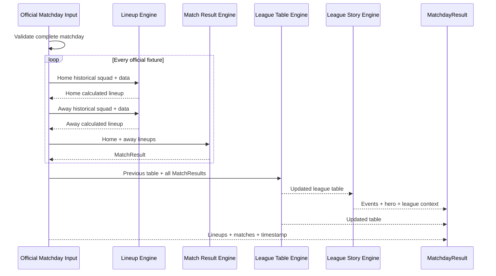

# BMS Matchday Processor

## Purpose

The Matchday Processor is the single public entry point for calculating an official league matchday. It coordinates the existing domain engines without duplicating their rules.

The processor is implemented in `app/domain/matchday-engine/matchday-processor.ts`. It contains no UI, React, database access, external API, AI, randomness, or competition-specific fallback invention.

`MatchdayResult` is the calculated audit snapshot. Application consumers use the canonical `OfficialMatchdayResult` produced by the Official Matchday Processor.

## Pipeline

## Input

The internal `processCalculatedMatchday()` stage receives:

- league competition configuration;
- matchday;
- previous league table;
- official fixtures;
- historical squad assignments;
- Kicker match data;
- manual penalties;
- team validity per manager;
- caller-supplied calculation timestamp.

The timestamp is supplied by the caller so the processor remains deterministic and testable.

## Fixture processing

For every official fixture:

1. resolve and calculate the home manager's historical lineup;
2. resolve and calculate the away manager's historical lineup;
3. apply each manager's active manual penalties;
4. send both calculated lineups to the Match Result Engine;
5. collect the official `MatchResult`.

All fixtures are completed before league aggregation starts.

## League and story processing

After every fixture:

1. the League Table Engine processes all match results once;
2. the League Story Engine receives that precomputed table;
3. the Event Engine generates real-data league events;
4. events are ranked;
5. the highest-priority event becomes the hero;
6. `LeagueContext` is generated.

The League Story Engine does not recalculate the table in this processor path.

## Validation

`validateMatchdayInput()` returns all detectable validation issues before calculation starts.

The processor detects:

- duplicate fixture IDs;
- duplicate home/away pairings;
- teams missing from the previous league table;
- managers appearing in multiple fixtures;
- managers without an official fixture;
- duplicate managers in the previous table;
- duplicate active squad-slot assignments;
- missing active lineup slots;
- missing or duplicate team-validity entries;
- invalid teams without a confirmed competition penalty rule;
- invalid calculation timestamps.

`processCalculatedMatchday()` throws `MatchdayValidationError` containing the complete `issues` array when validation fails. It never partially processes a matchday.

Invalid-team result handling is deliberately rejected until the final worst-result penalty rule is confirmed. The processor does not invent that rule.

## Immutability

The processor only reads supplied fixtures, assignments, match data, penalties, validity entries, and historical table rows.

Lower engines return new objects. The processor creates new lineup, match, table, event, context, and output arrays. No previous object is mutated.

## Output

`MatchdayResult` contains:

- competition configuration;
- matchday;
- calculated home and away lineups for every fixture;
- all official match results;
- updated league table;
- league context;
- all ranked events;
- hero event;
- calculation timestamp.

## Fixture

`app/domain/matchday-engine/fixture.ts` builds a complete six-team league with:

- three official fixtures;
- 108 historical squad assignments;
- Kicker data for all squads;
- one missing defender replaced by the correct backup;
- one unresolved forward position;
- one manual `-2` penalty;
- six valid teams;
- a leader change from Alpha FC to Beta 04.

The runtime fixture verifies:

- every fixture and team is calculated;
- replacement and missing-position statistics are correct;
- the manual penalty changes final team points;
- the league table updates;
- the leader-change event becomes the hero;
- the timestamp is returned unchanged;
- historical input remains unchanged;
- duplicate matches, missing teams, missing fixtures, duplicate managers, and missing lineup slots are detected.
