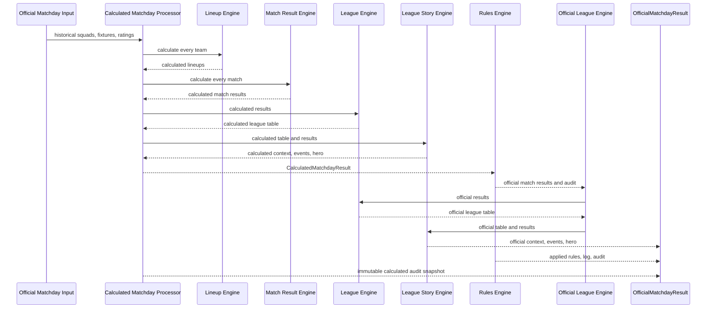

# Official Matchday Processor

## Purpose

The Official Matchday Processor is the canonical entry point for calculating and publishing a BMS matchday.

It preserves two separate records:

- the mathematically calculated matchday;
- the officially published matchday after administrative rules.

Calculation engines never receive or implement administrative decisions.

## Pipeline



## Public API

`processOfficialMatchday()` is exported from `app/domain/matchday-engine/index.ts`.

It is the only public calculation entry point for application modules. UI, History, Dashboard, Competitions, News, and Statistics consume its official output rather than calling Lineup, Match, League, Story, or Rules engines independently.

The previous processor remains as the internal `processCalculatedMatchday()` stage. It is not exported from the matchday-engine package entry point.

## Input

`ProcessOfficialMatchdayInput` extends the calculated processor input with:

- ordered BMS rules;
- deterministic publication timestamp.

The calculation input still includes:

- competition and matchday;
- previous league table;
- official fixtures;
- historical squad assignments;
- Kicker match data;
- mathematical manual penalties;
- calculation-time team validity;
- calculation timestamp.

Administrative publication decisions belong only in `rules`.

## Output

`OfficialMatchdayResult` contains:

### Calculated audit history

- all calculated lineups;
- calculated match results and team goals;
- calculated league table;
- calculated league context;
- calculated events and hero;
- calculation timestamp.

These values are never overwritten.

### Official canonical values

- official match results and team goals;
- official league table;
- official league context;
- official events;
- official hero event.

Only these values should be consumed by application presentation modules.

### Rule traceability

- applied rules;
- complete rule log;
- score-change audit trail;
- calculation and publication metadata.

Each official match stores its calculated result, calculated goals, official result, official goals, and applied rule IDs.

## Official League Recalculation

Rules are applied after the complete calculated matchday exists.

The processor then runs the League Table Engine and League Story Engine again using only official match results. Therefore:

- calculated tables remain mathematically reproducible;
- official tables reflect invalid teams, penalties, corrections, and overrides;
- official events and the hero use published results;
- UI consumers never need to apply rules themselves.

## Validation

The calculated processor already rejects:

- duplicate fixtures;
- duplicate managers;
- missing teams;
- missing fixtures;
- duplicate squad slots;
- missing lineups;
- invalid timestamps.

The official processor additionally fails when:

- calculated results do not cover every fixture;
- applied rules and rule logs differ;
- mutating rules and audit entries differ;
- an audit entry does not continue from the previous score;
- the final audited score differs from the official score;
- match-level applied rule IDs differ from the audit trail.

No incomplete or broken official matchday is returned.

## Historical Thomas Verification

`app/domain/matchday-engine/official-matchday-excel.fixture.ts` runs the supplied historical Excel snapshot through the complete pipeline.

The mathematical result remains:

```text
Thomas 13:28 Ben
```

The official rule is:

```text
TEAM_INVALID
Reason: No valid squad submitted
```

The canonical result becomes:

```text
Thomas 0:28 Ben
```

The fixture verifies:

- all nine historical fixtures are calculated;
- all nine official workbook scores are reproduced;
- Thomas's calculated `13` remains in audit history;
- Thomas's official league goals are `0`;
- Ben remains winner with three league points;
- official league context, events, and hero are generated;
- the `13 → 0` audit chain is complete;
- deliberately corrupted audit data is rejected;
- processor input remains unchanged.
